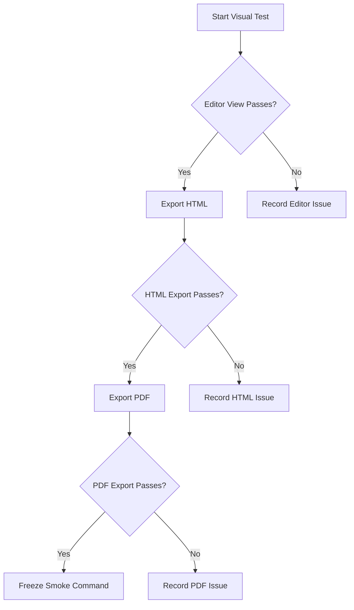

# Baptiste Studios Brand Kit Theme Visual Test

Version: 1.0
Date: 2026-06-17

## Test Instructions

Copy this entire document into Typora, switch to the appropriate theme, and review each section visually.


Test this document twice:

1. Night Command Umbra test theme.

2. Smoke Command test theme.

   

Expected result: the document should look deliberate, readable, and internally consistent across editor view, HTML export, and PDF export.


If something fails, capture:

- Section name
- What looked wrong
- Whether the issue appears in editor view, HTML export, PDF export, or more than one output
- Screenshot if possible

## 1. Document Frame And Body Text

This paragraph tests default prose styling. The text should feel comfortable for long reading, with clear contrast against the active writing surface and surrounding app background. Line spacing should not feel cramped, and the document frame should surround the writing area cleanly.

This paragraph includes **bold text**, *italic text*, ***bold italic text***, ~~strikethrough text~~, `inline code`, [a normal link](https://example.com), and a bare URL: https://example.com.

The italic text should be visibly lighter and should not collapse into the background. Inline code should look technical but not loud.

## 2. Headings

# H1 Heading: Primary Title

The H1 should establish the strongest hierarchy without feeling oversized or disconnected from the rest of the page.

## H2 Heading: Section Title

The H2 should be clearly subordinate to H1 but still strong.

### H3 Heading: Three-Dot Indicator Check

The H3 should show the accepted three-dot indicator and align cleanly with the heading text.

#### H4 Heading: Smaller Section

H4 should remain distinct from body text.

##### H5 Heading: Compact Label

H5 should not look broken, weak, or cramped.

###### H6 Heading: Smallest Label

H6 should still be legible.


**Result**

| Output    | Pass / Fail | Notes |
| --------- | ----------- | ----- |
| Heading 1 |             |       |
| Heading 2 |             |       |
| Heading 3 |             |       |
| Heading 4 |             |       |
| Heading 5 |             |       |
| Heading 6 |             |       |


---


## 3. Horizontal Rule

Text before the horizontal rule.

---

Text after the horizontal rule. The line, centered diamond, and hover behavior should remain clean. If hover spin is visible, it should not be distracting.


**Result**

| Output                  | Pass / Fail | Notes |
| ----------------------- | ----------- | ----- |
| Horizontal Line present |             |       |
| Glyph Present           |             |       |
| Glyph Rotates           |             |       |

---


## 4. Lists

### Unordered List

- First-level bullet
  - Second-level bullet
    - Third-level bullet
      - Fourth-level bullet
        - Fifth-level bullet
          - Sixth-level bullet
            - Seventh-level bullet
              - Eighth-level bullet
                - Ninth-level bullet
                  - Tenth-level bullet

The ten-level bullet styling should show a gradual size and color progression without connector lines.

### Ordered List

1. First ordered item
2. Second ordered item
   1. Nested ordered item
   2. Another nested ordered item
3. Third ordered item

Ordered lists should not show unwanted connector lines.

### Task List

- [ ] Unchecked task item
- [x] Checked task item
- [ ] Longer task item with enough text to wrap onto a second line so indentation and alignment can be inspected in Typora.

Task checkboxes should use the accepted accent color and align with list text.


**Result**

| Output              | Pass / Fail | Notes |
| ------------------- | ----------- | ----- |
| Unordered List      |             |       |
| 10 Glyphs Stairs    |             |       |
| 10 Glyphs in Order  |             |       |
| 10 Glyphs Colors    |             |       |
| Ordered List        |             |       |
| Task List Unchecked |             |       |
| Task List Checked   |             |       |
| Task List Colors    |             |       |

---


## 5. Blockquotes

> This is a standard blockquote. It should use the accepted large quote marker and remain readable.

> This is a longer blockquote with multiple sentences. It tests wrapping, indentation, contrast, and spacing. The quote marker should not collide with the text.

**Result**

| Output           | Pass / Fail | Notes |
| ---------------- | ----------- | ----- |
| Quote Glyph      |             |       |
| Accent Color     |             |       |
| Hover Color      |             |       |
| Background Color |             |       |


---


## 6. Callouts And Alerts

> [!NOTE]
> This note tests the note alert styling and icon.

> [!TIP]
> This tip tests the tip alert styling and icon.

> [!IMPORTANT]
> This important alert tests emphasis, icon placement, and watermark treatment.

> [!WARNING]
> This warning tests warning color contrast and icon treatment.

> [!CAUTION]
> This caution alert tests high-severity styling and readability.

Each alert should use the expected emoji icon, including the larger watermark icon if visible.


**Result**

| Output    | Pass / Fail | Notes |
| --------- | ----------- | ----- |
| Notes     |             |       |
| Tips      |             |       |
| Important |             |       |
| Warning   |             |       |
| Caution   |             |       |


---


## 7. Tables

| Element | Expected Appearance | Manual Result |
|---|---|---|
| Body text | Readable and calm | Pending |
| Links | Visible without being harsh | Pending |
| Inline code | Technical but controlled | Pending |
| Table | Centered and aligned | Pending |
| Borders | Visible but not heavy | Pending |

The table should be centered and should not stretch awkwardly across the full page.


**Result**

| Output       | Pass / Fail | Notes |
| ------------ | ----------- | ----- |
| Head Color   |             |       |
| Cell Color   |             |       |
| Border Color |             |       |
| Hover Color  |             |       |
| Line Color   |             |       |


---


## 8. Code Blocks

### JavaScript Code Block

```javascript
const themeName = "Baptiste Studios Theme";
const version = "visual-test";

function describeTheme(name, version) {
  return `${name} is ready for final visual testing at v${version}.`;
}

console.log(describeTheme(themeName, version));
```

### CSS Code Block

```css
:root {
  --surface: #15121d;
  --text: #d6c8ea;
}

#write {
  max-width: 900px;
  margin: 0 auto;
}
```


### JSON Code Block

```json
{
  "brand": "Baptiste Studios",
  "theme": "visual-test",
  "status": "testing"
}
```

### HTML Code Block

```html
<section class="brand-test">
  <h1>Baptiste Studios</h1>
  <p>HTML code label test.</p>
</section>
```

### Bash Code Block

```bash
echo "Testing shell label colors"
```

### Python Code Block

```python
theme = "Baptiste Studios"
print(theme)
```

### Markdown Code Block

```markdown
# Markdown Label Test

This tests markdown code-block label styling.
```

### Language-Free Code Block

```
This code block has no language.
It should display the accepted TEXT label.
It should use the same code-block width behavior as other fenced code blocks.
```

### Long-Line Code Block

```text
This is a deliberately long line intended to test horizontal overflow, wrapping behavior, code block width, and whether the block stays visually contained inside the theme document frame without breaking the layout or forcing the page to feel unstable.
```

Code blocks should use the theme colors, keep the red/yellow/green header dots, and respect the accepted width behavior.


**Result**

| Output        | Pass / Fail | Notes |
| ------------- | ----------- | ----- |
| Javascript    |             |       |
| CSS           |             |       |
| JSON          |             |       |
| HTML          |             |       |
| Bash          |             |       |
| Python        |             |       |
| Markdown      |             |       |
| Language Free |             |       |
| Long-Line     |             |       |


---


## 9. Math

Inline math: $E = mc^2$

Block math:

$$
\int_0^1 x^2 dx = \frac{1}{3}
$$

Math should remain readable and should not inherit broken colors.


**Result**

| Output           | Pass / Fail | Notes |
| ---------------- | ----------- | ----- |
| Math Visible     |             |       |
| Border Color     |             |       |
| Background Color |             |       |
| Hover Color      |             |       |


---


## 10. Mermaid Diagram



Mermaid edge labels should use pink boxes with light text.


**Result**

| Output              | Pass / Fail | Notes |
| ------------------- | ----------- | ----- |
| Background Color    |             |       |
| Inner Diagram Color |             |       |
| Border Color        |             |       |
| Yes/No Color        |             |       |


---


## 11. Inline TOC

[TOC]

The inline table of contents should have tight accepted spacing. In edit mode, links may require Ctrl+Click. That is expected Typora behavior.


**Result**

| Output          | Pass / Fail | Notes |
| --------------- | ----------- | ----- |
| Matches Outline |             |       |
| Clickable Links |             |       |
|                 |             |       |


---


## 12. Images

<svg xmlns="http://www.w3.org/2000/svg" width="900" height="360" viewBox="0 0 900 360" role="img" aria-label="Theme Command image rendering test">
  <rect width="900" height="360" fill="#17101F"/>
  <rect x="28" y="28" width="844" height="304" rx="18" fill="#21152F" stroke="#4B3764" stroke-width="4"/>
  <circle cx="156" cy="180" r="72" fill="#A78BFA" opacity="0.72"/>
  <circle cx="216" cy="180" r="72" fill="#F0A8C6" opacity="0.62"/>
  <text x="450" y="172" text-anchor="middle" fill="#E7DCF5" font-family="Georgia, serif" font-size="42" font-weight="700">Theme Command</text>
  <text x="450" y="222" text-anchor="middle" fill="#D6C8EA" font-family="Georgia, serif" font-size="24">Local SVG image test</text>
</svg>

The image should fit inside the document frame without breaking spacing.


**Result**

| Output           | Pass / Fail | Notes |
| ---------------- | ----------- | ----- |
| Background Color |             |       |
| Centered         |             |       |
| Border Color     |             |       |


---


## 13. HTML Elements

<kbd>Ctrl</kbd> + <kbd>Shift</kbd> + <kbd>P</kbd>

<mark>Highlighted text should remain readable.</mark>

<details>
<summary>Expandable details test</summary>

This hidden content tests Typora's handling of native HTML elements under the theme.

</details>


<div class="raw-html-test">
  <p>This raw HTML block should not inherit harsh white, pure black, or generic gray styling.</p>
</div>


**Result**

| Output             | Pass / Fail | Notes |
| ------------------ | ----------- | ----- |
| Button Move        |             |       |
| Button Hover       |             |       |
| Highlighted Text   |             |       |
| Expandable Details |             |       |
| Hidden Content     |             |       |
| Raw HTML Block     |             |       |


---


## 14. Footnotes

This sentence includes a footnote reference.[^theme-command-footnote]

[^theme-command-footnote]: This is the footnote body. It should remain readable and visually connected to the reference.


**Result**

| Output               | Pass / Fail | Notes |
| -------------------- | ----------- | ----- |
| Footnote Higher      |             |       |
| Footnote Color       |             |       |
| Hover Color          |             |       |
| Note Underneath Line |             |       |


---


## 15. Definition-Style Content

**Dark Command Umbra**
: A dark Typora theme built around controlled contrast, editorial typography, and styled technical content.

**Smoke Command**
: The future light-theme counterpart.

Definition terms should be bold. Definition lines should be indented.


**Result**

| Output     | Pass / Fail | Notes |
| ---------- | ----------- | ----- |
| Name       |             |       |
| Definition |             |       |
| Colors     |             |       |
| Hover      |             |       |


---


## Known Contrast Defect Checks

### Light Inline Code Contrast

This sentence contains `inline code that must remain readable on the light inline-code background`.

Expected result:

- Inline code text is clearly readable.
- Inline code does not blur into the background.
- Inline code remains visually technical without becoming harsh.

### Light Primary Prose Contrast

This paragraph tests primary prose on the actual writing surface. It should be readable for long-form writing without eye strain. If the text looks too faint, too saturated, or too decorative, record the issue.


**Result**

| Output               | Pass / Fail | Notes |
| -------------------- | ----------- | ----- |
| Inline Code Contrast |             |       |
|                      |             |       |
|                      |             |       |


---


## 16. Sidebar, Outline, Menus, And Controls

Manual checks outside the document body:

- Sidebar file list text should use the accepted color.
- File-list separators should remain removed.
- Outline spacing should be tight but readable.
- Menus should match the theme’s surface and text treatment.
- Popovers should not show harsh white or gray rows.
- Scrollbars should look intentional.
- Preferences should match the theme.
- Footer and word-count controls should remain readable.


**Result**

| Output                | Pass / Fail | Notes |
| --------------------- | ----------- | ----- |
| Sidebar               |             |       |
| File-list             |             |       |
| Outline               |             |       |
| Menus                 |             |       |
| Popovers              |             |       |
| Scrollbars            |             |       |
| Preferences           |             |       |
| Footer and Word-Count |             |       |


---


## 17. Export Checks

### HTML Export

Export this document to HTML.

Expected result:

- Light page background remains.
- Document frame survives.
- Headings, code blocks, alerts, tables, and Mermaid output look intentional.
- No large white areas appear.

### PDF Export

Export this document to PDF.

Expected result:

- Light page background remains.
- Page margins are tight.
- Content is not oversized.
- Code blocks do not break the page layout.
- No reverted scaling behavior appears.


**Result**

| Output      | Pass / Fail | Notes |
| ----------- | ----------- | ----- |
| Editor      |             |       |
| HTML Export |             |       |
| PDF Export  |             |       |


---


## 18. Final Result

Use this checklist after testing:

- [ ] Editor view passes

- [ ] Sidebar and outline pass
- [ ] Menus and popovers pass
- [ ] HTML export passes
- [ ] PDF export passes
- [ ] Known limitations are acceptable
- [ ] Theme is approved for this test round

  

  

  

  

  

  

  


**Result**

| Output       | Pass / Fail | Notes |
| ------------ | ----------- | ----- |
| Final Result |             |       |
|              |             |       |
|              |             |       |


---


<!-- END OF DOCUMENT -->
