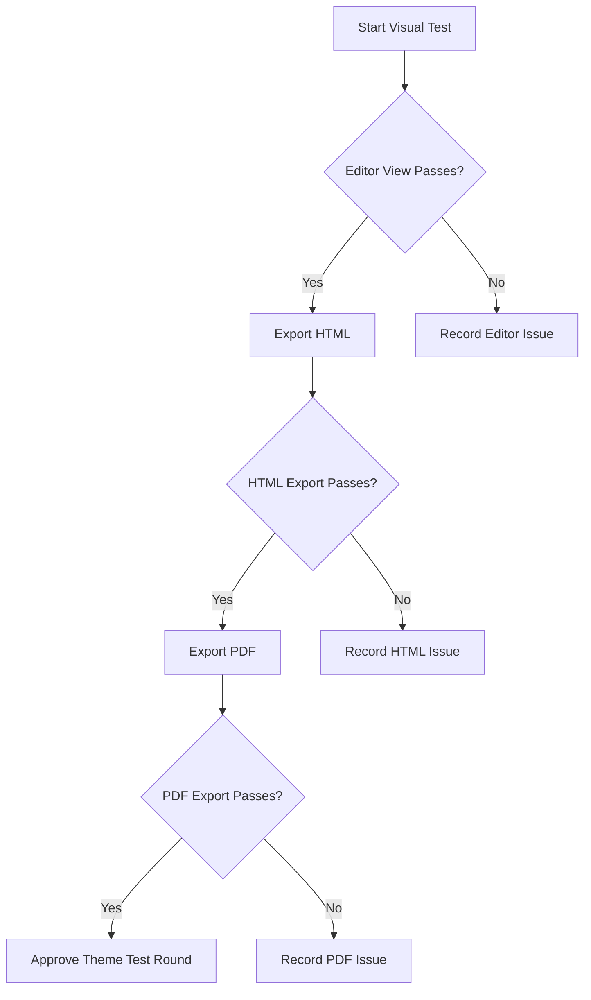

# Baptiste Studios Brand Kit Theme Visual Test

Version: 1.10
Date: 2026-08-04

## Test Instructions

Copy this entire document into Typora, switch to the appropriate theme, and review each section visually.

Test this document twice:

1. Night Command Umbra test theme.
2. Smoke Command test theme.

Expected result: the document should look deliberate, readable, and internally consistent across editor view, HTML export, and PDF export.

### Required Test Protocol

Use this sequence for every theme. Typora may retain stale theme CSS when themes are switched without restarting.

1. Save the document and wait for GoodSync to finish synchronizing theme files.
2. Fully close Typora.
3. Reopen Typora and open this document.
4. Select the theme being tested.
5. Complete the applicable build checklist in Section 18.
6. Record Dark and Light results separately.
7. Capture a screenshot for every failure and note whether it occurs at rest, on hover, while editing, or after export.

Do not judge small alignment or spacing changes until Typora has been fully closed and reopened.

If something fails, capture:

- Section name
- What looked wrong
- Whether the issue appears in editor view, HTML export, PDF export, or more than one output
- Screenshot if possible

---

## 1. Document Frame And Body Text

This paragraph tests default prose styling. The text should feel comfortable for long reading, with clear contrast against the active writing surface and surrounding app background. Line spacing should not feel cramped, and the document frame should surround the writing area cleanly.

This paragraph includes **bold text**, *italic text*, ***bold italic text***, ~~strikethrough text~~, `inline code`, [a normal link](https://example.com), and a bare URL: https://example.com.

The italic text should be visibly lighter and should not collapse into the background. Inline code should look technical but not loud.

**Result**

| Output | Pass / Fail | Notes |
| ------ | ----------- | ----- |
| Body text | Pass |       |
| Bold text | Pass |       |
| Italic text | Pass |       |
| Bold italic text | Pass |       |
| Strikethrough text | Pass |       |
| Inline code | Pass |       |
| Links | Pass |       |
| Bare URL | Pass |       |
| Document frame | Pass |       |

---

## 2. Headings

# H1 Heading: Primary Title

The H1 should establish the strongest hierarchy without feeling oversized or disconnected from the rest of the page.

## H2 Heading: Section Title

The H2 should be clearly subordinate to H1 but still strong.

### H3 Heading: Indicator / Alignment Check

Dark theme should show the accepted heading indicator. Light theme may hide the indicator but should preserve clean heading alignment.

#### H4 Heading: Smaller Section

H4 should remain distinct from body text.

##### H5 Heading: Compact Label

H5 should not look broken, weak, or cramped.

###### H6 Heading: Smallest Label

H6 should still be legible.

**Result**

| Output | Pass / Fail | Notes |
| ------ | ----------- | ----- |
| Heading 1 | Pass |       |
| Heading 2 | Pass |       |
| Heading 3 | Pass |       |
| Heading 4 | Pass |       |
| Heading 5 | Pass |       |
| Heading 6 | Pass |       |
| Heading indicators | Pass |       |
| Heading alignment | Pass |       |

---

## 3. Horizontal Rule

Text before the horizontal rule.

---

Text after the horizontal rule. The line, centered ✦ glyph, and hover behavior should remain clean. If hover spin is visible, it should not be distracting.

**Result**

| Output | Pass / Fail | Notes |
| ------ | ----------- | ----- |
| Horizontal line present | Pass |       |
| Centered ✦ glyph present | Pass |       |
| Glyph rotates on hover | Pass |       |
| Spacing before/after rule | Pass |       |

---

## 4. Lists

### Unordered List

- First-level bullet
  - Second-level bullet
    - Third-level bullet
      - Fourth-level bullet
        - Fifth-level bullet
          - Sixth-level bullet
            - Seventh-level bullet
              - Eighth-level bullet
                - Ninth-level bullet
                  - Tenth-level bullet

The ten-level bullet styling should show a gradual size and color progression without connector lines.

### Ordered List

1. First ordered item
2. Second ordered item
   1. Nested ordered item
   2. Another nested ordered item
3. Third ordered item

Ordered lists should not show unwanted connector lines.

### Task List

- [ ] Unchecked task item
- [x] Checked task item
- [ ] Longer task item with enough text to wrap onto a second line so indentation and alignment can be inspected in Typora.

Task checkboxes should use the accepted accent color and align with list text.

**Result**

| Output | Pass / Fail | Notes |
| ------ | ----------- | ----- |
| Unordered list | Pass |       |
| 10 glyph stairs | Pass |       |
| 10 glyphs in order | Pass |       |
| 10 glyph colors | Pass |       |
| Ordered list | Pass |       |
| Task list unchecked | Pass |       |
| Task list checked | Pass |       |
| Task list colors | Pass |       |
| Wrapped task alignment | Pass |       |

---

## 5. Blockquotes

> This is a standard blockquote. It should use the accepted large quote marker and remain readable.

> This is a longer blockquote with multiple sentences. It tests wrapping, indentation, contrast, and spacing. The quote marker should not collide with the text.

**Result**

| Output | Pass / Fail | Notes |
| ------ | ----------- | ----- |
| Quote glyph | Pass |       |
| Accent color | Pass |       |
| Hover color | Pass |       |
| Background color | Pass |       |
| Border color | Pass |       |
| Text readability | Pass |       |

---

## 6. Callouts And Alerts

> [!NOTE]
> This note tests the note alert styling and icon.

> [!TIP]
> This tip tests the tip alert styling and icon.

> [!IMPORTANT]
> This important alert tests emphasis, icon placement, and watermark treatment.

> [!WARNING]
> This warning tests warning color contrast and icon treatment.

> [!CAUTION]
> This caution alert tests high-severity styling and readability.

Each alert should use the expected emoji icon, including the larger watermark icon if visible.

**Result**

| Output | Pass / Fail | Notes |
| ------ | ----------- | ----- |
| Note | Pass |       |
| Tip | Pass |       |
| Important | Pass |       |
| Warning | Pass |       |
| Caution | Pass |       |
| Alert hover surface | Pass |       |
| Alert watermark icon | Pass |       |

---

## 7. Tables

| Element | Expected Appearance | Manual Result |
|---|---|---|
| Body text | Readable and calm | Pass |
| Links | Visible without being harsh | Pass |
| Inline code | Technical but controlled | Pass |
| Table | Centered and aligned | Pass |
| Borders | Visible but not heavy | Pass |

The table should be centered and should not stretch awkwardly across the full page.

**Result**

| Output | Pass / Fail | Notes |
| ------ | ----------- | ----- |
| Header color | Pass |       |
| Cell color | Pass |       |
| Border color | Pass |       |
| Hover color | Pass |       |
| Line color | Pass |       |
| Table width | Pass |       |
| Table alignment | Pass |       |
| Table line border | Pass | Night Command Umbra v3.25 and Smoke Command v2.70 produce connected rounded boundaries with consistent 2px outer frames. |

---

## 8. Code Blocks

### JavaScript Code Block

```javascript
const themeName = "Baptiste Studios Theme";
const version = "visual-test";

function describeTheme(name, version) {
  return `${name} is ready for final visual testing at v${version}.`;
}

console.log(describeTheme(themeName, version));
```

### CSS Code Block

```css
:root {
  --surface: #15121d;
  --text: #d6c8ea;
}

#write {
  max-width: 900px;
  margin: 0 auto;
}
```

### JSON Code Block

```json
{
  "brand": "Baptiste Studios",
  "theme": "visual-test",
  "status": "testing"
}
```

### HTML Code Block

```html
<section class="brand-test">
  <h1>Baptiste Studios</h1>
  <p>HTML code label test.</p>
</section>
```

### Bash Code Block

```bash
echo "Testing shell label colors"
```

### Python Code Block

```python
theme = "Baptiste Studios"
print(theme)
```

### Markdown Code Block

```markdown
# Markdown Header 1 Test
## Markdown Header 2 Test
### Markdown Header 3 Test
#### Markdown Header 4 Test
##### Markdown Header 5 Test
###### Markdown Header 6 Test

This tests markdown code-block label styling.
```

### Language-Free Code Block

```
This code block has no language.
It should display the accepted TEXT label.
It should use the same code-block width behavior as other fenced code blocks.
```

### Long-Line Code Block

```text
This is a deliberately long line intended to test horizontal overflow, wrapping behavior, code block width, and whether the block stays visually contained inside the theme document frame without breaking the layout or forcing the page to feel unstable.
```

Code blocks should use the theme colors, keep the red/yellow/green header dots, and respect the accepted width behavior.

**Result**

| Output | Pass / Fail | Notes |
| ------ | ----------- | ----- |
| JavaScript | Pass |       |
| CSS | Pass |       |
| JSON | Pass |       |
| HTML | Pass |       |
| Bash | Pass |       |
| Python | Pass |       |
| Markdown | Pass |       |
| Language-free | Pass |       |
| Long-line | Pass |       |
| Code label colors | Pass |       |
| Code block width | Pass |       |
| Code block focus | Pass |       |

---

## 9. Math

Inline math: $E = mc^2$

Block math:

$$
\int_0^1 x^2 dx = \frac{1}{3}
$$

Math should remain readable and should not inherit broken colors.

**Result**

| Output | Pass / Fail | Notes |
| ------ | ----------- | ----- |
| Math visible | Pass |       |
| Border color | Pass |       |
| Background color | Pass |       |
| Hover color | Pass |       |
| Editing state | Pass |       |

---

## 10. Mermaid Diagram



Mermaid edge labels should use the accepted theme treatment and remain readable.

**Result**

| Output | Pass / Fail | Notes |
| ------ | ----------- | ----- |
| Background color | Pass |       |
| Inner diagram color | Pass |       |
| Border color | Pass |       |
| Yes/No label color | Pass |       |
| Edge label readability | Pass |       |
| Export behavior | Pass | The complete Mermaid diagram fits on page 12 without a blank page or diagram fragmentation. The result table continues normally on page 13, and HTML export remains readable. |

---

## 11. Inline TOC

[TOC]

The inline table of contents should have tight accepted spacing. A normal single click should navigate directly to the selected section.

**Result**

| Output | Pass / Fail | Notes |
| ------ | ----------- | ----- |
| Matches outline | Pass |       |
| Clickable links | Pass |       |
| Spacing | Pass |       |
| Text contrast | Pass |       |

---

## 12. Images

<svg xmlns="http://www.w3.org/2000/svg" width="900" height="360" viewBox="0 0 900 360" role="img" aria-label="Theme Command image rendering test">
  <rect width="900" height="360" fill="#17101F"/>
  <rect x="28" y="28" width="844" height="304" rx="18" fill="#21152F" stroke="#4B3764" stroke-width="4"/>
  <circle cx="156" cy="180" r="72" fill="#A78BFA" opacity="0.72"/>
  <circle cx="216" cy="180" r="72" fill="#F0A8C6" opacity="0.62"/>
  <text x="450" y="172" text-anchor="middle" fill="#E7DCF5" font-family="Georgia, serif" font-size="42" font-weight="700">Theme Command</text>
  <text x="450" y="222" text-anchor="middle" fill="#D6C8EA" font-family="Georgia, serif" font-size="24">Local SVG image test</text>
</svg>

<figure>
  <svg xmlns="http://www.w3.org/2000/svg" width="900" height="240" viewBox="0 0 900 240" role="img" aria-label="Figure caption test image">
    <rect width="900" height="240" fill="#21152F"/>
    <text x="450" y="128" text-anchor="middle" fill="#E7DCF5" font-family="Georgia, serif" font-size="36">Figure Caption Test</text>
  </svg>
  <figcaption>This figcaption tests caption color, spacing, alignment, and hover behavior.</figcaption>
</figure>

The image should fit inside the document frame without breaking spacing.

**Result**

| Output | Pass / Fail | Notes |
| ------ | ----------- | ----- |
| Image background color | Pass |       |
| Image centered | Pass | The raw SVG canvas is centered in the latest Dark editor and PDF export. |
| Image border color | Pass |       |
| Figure caption color | Pass |       |
| Figure caption spacing | Pass |       |
| Figure caption hover | Pass |       |
| Figure centered | Pass | The figure SVG canvas is centered in the latest Dark editor and PDF export. |

---

## 13. HTML Elements

<kbd>Ctrl</kbd> + <kbd>Shift</kbd> + <kbd>P</kbd>

Keyboard tokens should look like compact UI controls, remain readable, and avoid harsh white, pure black, or neutral gray styling.

<mark>Highlighted text should remain readable.</mark>

<details>
<summary>Expandable details test</summary>

This hidden content tests Typora's handling of native HTML elements under the theme.

</details>

<div class="raw-html-test">
  <p>This raw HTML block should not inherit harsh white, pure black, or generic gray styling.</p>
</div>

**Result**

| Output | Pass / Fail | Notes |
| ------ | ----------- | ----- |
| Keyboard token rest state | Pass |       |
| Keyboard token hover state | Pass |       |
| Highlighted text | Pass |       |
| Expandable details | Pass |       |
| Hidden content | Pass |       |
| Raw HTML block | Pass |       |

---

## 14. Footnotes

This sentence includes a footnote reference.[^theme-command-footnote]

[^theme-command-footnote]: This is the footnote body. It should remain readable and visually connected to the reference.

**Result**

| Output | Pass / Fail | Notes |
| ------ | ----------- | ----- |
| Footnote reference position | Pass |       |
| Footnote color | Pass |       |
| Hover color | Pass |       |
| Footnote section divider | Pass |       |
| Footnote body readability | Pass |       |

---

## 15. Definition-Style Content

**Night Command Umbra**
: A dark Typora theme built around controlled contrast, editorial typography, and styled technical content.

**Smoke Command**
: The future light-theme counterpart.

Definition terms should be bold. Definition lines should be indented.

**Result**

| Output | Pass / Fail | Notes |
| ------ | ----------- | ----- |
| Name | Pass |       |
| Definition | Pass |       |
| Colors | Pass |       |
| Hover | Pass |       |

---

## Known Contrast Defect Checks

### Light Inline Code Contrast

This sentence contains `inline code that must remain readable on the light inline-code background`.

Expected result:

- Inline code text is clearly readable.
- Inline code does not blur into the background.
- Inline code remains visually technical without becoming harsh.

### Light Primary Prose Contrast

This paragraph tests primary prose on the actual writing surface. It should be readable for long-form writing without eye strain. If the text looks too faint, too saturated, or too decorative, record the issue.

### Light Figcaption Contrast

Review the figure caption in the Images section. It should remain readable on the light canvas and should not look like a leftover dark-theme value.

### Light Filled-Button Text

Use Typora controls, popovers, dialogs, or theme UI buttons to verify that filled-button text is readable and does not use an overly dim lilac value.

**Result**

| Output | Pass / Fail | Notes |
| ------ | ----------- | ----- |
| Light inline code contrast | N/A | Light-only check; validate during Smoke Command testing. |
| Light primary prose contrast | N/A | Light-only check; validate during Smoke Command testing. |
| Light figcaption contrast | N/A | Light-only check; validate during Smoke Command testing. |
| Light filled-button text | N/A | Light-only check; validate during Smoke Command testing. |

---

## 16. Sidebar, Outline, Menus, And Controls

Manual checks outside the document body:

- Sidebar file list text should use the accepted color.
- File-list separators should remain removed.
- Outline spacing should be tight but readable.
- Menus should match the theme’s surface and text treatment.
- Popovers should not show harsh white or gray rows.
- Scrollbars should look intentional.
- Preferences should match the theme.
- Footer and word-count controls should remain readable.

**Result**

| Output | Pass / Fail | Notes |
| ------ | ----------- | ----- |
| Sidebar | Pass |       |
| File list | Pass |       |
| Outline | Pass |       |
| Menus | Pass |       |
| Popovers | Pass |       |
| Scrollbars | Pass |       |
| Preferences | Pass |       |
| Footer and word count | Pass |       |

---

## 17. Export Checks

### HTML Export

Export this document to HTML.

Expected result:

- Theme page background remains.
- Document frame survives.
- Headings, code blocks, alerts, tables, and Mermaid output look intentional.
- No large white areas appear.

### PDF Export

Export this document to PDF.

Expected result:

- Theme page background remains.
- Page margins are tight.
- Content is not oversized.
- Code blocks do not break the page layout.
- No reverted scaling behavior appears.

**Result**

| Output | Pass / Fail | Notes |
| ------ | ----------- | ----- |
| Editor | Pass |       |
| HTML export | Pass |       |
| PDF export | Pass | Night Command Umbra v3.24 and Smoke Command v2.70 both complete in 30 pages with white print surfaces, intact Mermaid pagination, and the final footnote integrated beneath the version history on page 30. |

---

## 18. Build Validation Dashboard

Use the visual fixtures above together with the manual checks below. Enter Pass or Fail in both theme columns. Leave CSS unchanged when a build passes.

### Build 1: Headings

| Check | Expected result | Dark | Light | Notes |
| --- | --- | --- | --- | --- |
| H1 hierarchy | Strongest heading; centered title and underline remain balanced | Pass | Pass |  |
| H2 panel | Text is vertically centered inside the raised panel | Pass | Pass |  |
| H3 marker | Left marker and heading text share the same visual center | Pass | Pass |  |
| H3 trailing dots | Dots align with the accepted dark-theme relationship | Pass | Pass |  |
| H4 marker | Filled circular marker is centered with the text | Pass | Pass |  |
| H5 marker | Ring marker is centered with the text | Pass | Pass |  |
| H6 marker | Dash marker and trailing dots remain balanced | Pass | Pass |  |
| Heading hover | Glow and halo appear without shifting text or markers | Pass | Pass |  |

### Build 2: Inline TOC

| Check | Expected result | Dark | Light | Notes |
| --- | --- | --- | --- | --- |
| Title | Table of Contents title is centered and readable | Pass | Pass |  |
| H1-H6 indentation | Each heading level advances consistently | Pass | Pass |  |
| Long-entry wrapping | Narrow the window; wrapped entries remain inside the TOC | Pass | Pass |  |
| Hover row | Hover surface spans the available row without moving the text | Pass | Pass |  |
| Single-click navigation | One click navigates to the selected section | Pass | Pass |  |
| Container growth | The TOC contains the complete generated list without internal clipping | Pass | Pass |  |
| Theme parity | Dark and Light preserve the same hierarchy and spacing | Pass | Pass |  |

### Build 3: Files, Outline, And Search Tabs

Open the sidebar and test Files, Outline, and Search at rest, on hover, and while selected.

| Check | Expected result | Dark | Light | Notes |
| --- | --- | --- | --- | --- |
| Active tab underline | Selected tab has a visible, centered accent underline | Pass | Pass |  |
| Inactive tab | Inactive tabs are dimmer but remain readable | Pass | Pass |  |
| Tab hover | Hover is visible without resembling the selected state | Pass | Pass |  |
| File selection | Selected file row is distinct and text remains readable | Pass | Pass |  |
| File hover | Hover surface does not introduce unwanted separators | Pass | Pass |  |
| Outline hierarchy | Heading levels are indented consistently and remain compact | Pass | Pass |  |
| Outline selection | Active outline entry is distinct without clipping | Pass | Pass |  |
| Search field | Input, placeholder, border, and focus state match the theme | Pass | Pass |  |
| Search results | Match highlighting, selected result, and surrounding text are readable | Pass | Pass |  |
| Empty state | Empty or no-results message remains readable | Pass | Pass |  |

### Build 4: Math And Mermaid

Use Sections 9 and 10. Enter and leave edit mode for each fixture.

| Check | Expected result | Dark | Light | Notes |
| --- | --- | --- | --- | --- |
| Inline math | Formula aligns with surrounding prose and remains readable | Pass | Pass |  |
| Block math rendered | Rendered formula is centered and contained | Pass | Pass |  |
| Block math editing | Source, border, background, and focus state are readable | Pass | Pass |  |
| Math overflow | A wide formula scrolls or contains itself without breaking the frame | Pass | Pass |  |
| Mermaid rendered | Nodes, arrows, text, and background remain readable | Pass | Pass |  |
| Mermaid edge labels | Yes/No labels have sufficient contrast | Pass | Pass |  |
| Mermaid source | Source editor and syntax colors remain readable | Pass | Pass |  |
| Mermaid focus | Editing border and handles are visible without duplicate outlines | Pass | Pass |  |
| Mermaid overflow | Diagram stays inside the document frame | Pass | Pass |  |

### Build 5: Raw HTML And SVG

Use Sections 12 and 13. Enter raw-source editing mode where Typora permits it.

| Check | Expected result | Dark | Light | Notes |
| --- | --- | --- | --- | --- |
| SVG sizing | SVG remains centered and contained within the writing frame | Pass | Pass | Raw SVG and figure canvases are centered and contained. |
| SVG border | Only the intended border is visible; no duplicate editor border appears | Pass | Pass |  |
| Figure caption | Caption alignment, spacing, contrast, and hover state are correct | Pass | Pass |  |
| Raw HTML rendered | Rendered block uses theme surfaces and readable text | Pass | Pass |  |
| Raw HTML editing | Opening and closing source are readable and visually contained | Pass | Pass |  |
| Details rest state | Summary row is readable and the disclosure marker is aligned | Pass | Pass |  |
| Details expanded | Hidden content opens cleanly without border collisions | Pass | Pass |  |
| Keyboard tokens | `kbd` tokens are readable at rest and on hover | Pass | Pass |  |
| Mark highlight | Highlighted text retains sufficient foreground contrast | Pass | Pass |  |

### Build 6: Code Blocks

Use all fixtures in Section 8. Click inside and outside each representative block.

| Check | Expected result | Dark | Light | Notes |
| --- | --- | --- | --- | --- |
| Rest state | Block surface, border, header dots, and code are readable | Pass | Pass |  |
| Focus state | Focus treatment is visible without changing block width | Pass | Pass |  |
| Syntax colors | JavaScript, CSS, JSON, HTML, Bash, Python, and Markdown remain distinct | Pass | Pass |  |
| Language label | Each language label is readable and correctly named | Pass | Pass |  |
| Language editor | Clicking the label exposes a usable language input | Pass | Pass |  |
| Language-free label | Unspecified fenced block displays the accepted `TEXT` label | Pass | Pass |  |
| Gutters | Line-number or code gutters align and do not crowd content | Pass | Pass |  |
| Long-line overflow | Long code scrolls horizontally and does not widen the page | Pass | Pass |  |
| Copy controls | Any visible block controls remain readable and correctly positioned | Pass | Pass |  |
| Exported code | HTML and PDF preserve containment and readable syntax | Pass | Pass |  |

### Build 7: HTML And PDF Export

Export this complete document to HTML and PDF after editor validation passes.

| Check | Expected result | Dark | Light | Notes |
| --- | --- | --- | --- | --- |
| HTML page background | Theme background covers the complete exported page | Pass | Pass |  |
| HTML document frame | Writing surface, width, and borders remain intentional | Pass | Pass |  |
| HTML components | Headings, alerts, tables, code, math, Mermaid, HTML, and SVG survive | Pass | Pass |  |
| HTML navigation | Inline TOC links navigate to the correct headings | Pass | Pass |  |
| PDF background | Page, document, and CSS-controlled component backgrounds print as `#FFFFFF` or transparent over white, with no colored page bars | Pass | Pass | Both verified exports use white page surfaces without colored top or bottom bands. |
| PDF margins | Accepted `@page` margin of `1mm`, page padding of `0`, and printed `#write` padding of `3mm` remain tight | Pass | Pass | Night Command Umbra v3.24 and Smoke Command v2.70 use the shared accepted print geometry. |
| PDF scale | Text and components are not oversized or compressed | Pass | Pass | Both verified exports complete in 30 pages without rejected scaling overrides. |
| PDF page breaks | Blocks do not split in visibly broken positions | Pass | Pass | The complete Mermaid diagram fits on page 12, its result table continues on page 13, and the final footnote remains beneath the version history on page 30. |
| PDF H2 panel | H2 surface exports without duplicate boxes or artifacts | Pass | Pass | Verified in both final PDF exports. |

### Build 8: General Document Elements

Review Sections 1 and 3 through 15 in editor view and on hover where applicable.

| Check | Expected result | Dark | Light | Notes |
| --- | --- | --- | --- | --- |
| Body prose | Long-form text has comfortable contrast, width, and line spacing | Pass | Pass |  |
| Emphasis | Bold, italic, bold italic, and strikethrough are distinct | Pass | Pass |  |
| Links | Normal, bare, hover, and visited links remain recognizable | Pass | Pass |  |
| Inline code | Text and surface contrast remain readable | Pass | Pass |  |
| Horizontal rule | Line, center glyph, spacing, and hover animation are balanced | Pass | Pass |  |
| Unordered lists | Ten nesting levels preserve glyph order, color, and alignment | Pass | Pass |  |
| Ordered lists | Nested numbering aligns without connector artifacts | Pass | Pass |  |
| Task lists | Checked, unchecked, hover, and wrapped tasks align correctly | Pass | Pass |  |
| Blockquotes | Marker, border, background, hover, and wrapped text remain readable | Pass | Pass | Night Command Umbra v3.25 preserves the accepted purple quote marker at rest and pink marker on hover after the font-asset relocation. |
| Alerts | Note, Tip, Important, Warning, and Caution remain distinct and readable | Pass | Pass |  |
| Tables | Header, cells, borders, hover, width, and alignment are correct | Pass | Pass | Night Command Umbra v3.25 and Smoke Command v2.70 produce connected rounded outer corners with consistent frame weight. |
| Images | Images remain centered, contained, and correctly bordered | Pass | Pass | Raw SVG image and figure canvases are centered in both final theme exports. |
| Footnotes | Reference, hover, divider, and footnote body remain connected | Pass | Pass | Both final exports keep the footnote readable below the version-history table on page 30 without creating an isolated trailing page. |
| Definition content | Terms, definitions, indentation, colors, and hover are correct | Pass | Pass |  |
| Focus mode | Focused content is readable and dimmed content remains identifiable | Pass | Pass |  |

### Build 9: Typora Interface Sweep

Perform these checks outside the document body.

| Check | Expected result | Dark | Light | Notes |
| --- | --- | --- | --- | --- |
| Preferences | Panels, labels, controls, inputs, and selected navigation match the theme | Pass | Pass |  |
| Menus | Menu surface, hover, disabled text, separators, and shortcuts are readable | Pass | Pass |  |
| Inputs | Rest, hover, focus, placeholder, and disabled states are distinct | Pass | Pass |  |
| Popovers | Popovers use theme surfaces without harsh white or generic gray rows | Pass | Pass |  |
| Footer | Word count, mode controls, and footer text remain readable | Pass | Pass |  |
| Source mode | Markdown source, selection, caret, and syntax remain readable | Pass | Pass |  |
| Find | Find field, match count, navigation buttons, and highlights are readable | Pass | Pass |  |
| Quick Open | Field, results, hover, selection, and empty state match the theme | Pass | Pass |  |
| Notifications | Message surface, text, icons, buttons, and close control are readable | Pass | Pass |  |
| Scrollbars | Track, thumb, hover, and active states are visible but restrained | Pass | Pass |  |
| Modal dialogs | Dialog surface, title, body, fields, and buttons remain readable | Pass | Pass |  |
| Window chrome | Title bar and window controls remain consistent with the theme | Pass | Pass |  |

### Build Acceptance Record

| Build | Scope | Dark | Light | Accepted / Date | Notes |
| --- | --- | --- | --- | --- | --- |
| 1 | Headings | Pass | Pass | 2026-08-04 |  |
| 2 | Inline TOC | Pass | Pass | 2026-08-04 |  |
| 3 | Files, Outline, and Search tabs | Pass | Pass | 2026-08-04 |  |
| 4 | Math and Mermaid | Pass | Pass | 2026-08-04 |  |
| 5 | Raw HTML and SVG | Pass | Pass | 2026-08-04 |  |
| 6 | Code blocks | Pass | Pass | 2026-08-04 |  |
| 7 | HTML and PDF export | Pass | Pass | 2026-08-04 | Night Command Umbra v3.24 and Smoke Command v2.70 remain the accepted export baselines. Night v3.25 changes only the location of byte-identical font assets and preserves the accepted editor rendering. |
| 8 | General document elements | Pass | Pass | 2026-08-04 | Rounded table boundaries and consistent frame weight pass in both final theme reviews. |
| 9 | Typora interface sweep | Pass | Pass | 2026-08-04 |  |

---

## 19. Final Result

Use this checklist after testing:

- [x] Editor view passes
- [x] Sidebar and outline pass
- [x] Menus and popovers pass
- [x] HTML export passes
- [x] PDF export passes
- [x] Known limitations are acceptable
- [x] Theme is approved for this test round

**Result**

| Output | Pass / Fail | Notes |
| ------ | ----------- | ----- |
| Final result | Pass | Night Command Umbra v3.25 and Smoke Command v2.70 are the final passing theme versions. Night v3.25 relocates byte-identical font assets into the Umbra directory and preserves the accepted editor rendering; the accepted Night v3.24 and Smoke v2.70 export baselines remain unchanged. |

---

## Version History

| Version | Date | Change summary |
| --- | --- | --- |
| 1.2 | 2026-07-12 | Added the complete theme validation protocol and build acceptance dashboard. |
| 1.3 | 2026-07-31 | Recorded the Dark audit results for tables, raw SVG alignment, Mermaid export, and PDF layout. |
| 1.4 | 2026-08-01 | Corrected the Dark export diagnosis and updated SVG, table-boundary, page-padding, and Mermaid validation records. |
| 1.5 | 2026-08-01 | Replaced the disproven PDF-padding diagnosis with measured page-band evidence and updated the latest Mermaid pagination failure. |
| 1.6 | 2026-08-01 | Recorded passing Dark table boundaries and Mermaid pagination while retaining the PDF background and margin failures. |
| 1.7 | 2026-08-04 | Recorded passing Dark and Light PDF backgrounds, margins, scale, Mermaid pagination, and final-footnote pagination. |
| 1.8 | 2026-08-04 | Completed all Dark and Light dashboard checks; recorded Night Command Umbra v3.23 and Smoke Command v2.70 as the final passing versions; and accepted the complete 30-page PDF exports. |
| 1.9 | 2026-08-04 | Recorded Night Command Umbra v3.24 as the final passing Dark version after confirming its exported HTML blockquote marker is purple at rest and pink on hover; retained Smoke Command v2.70 as the final passing Light version. |
| 1.10 | 2026-08-04 | Recorded Night Command Umbra v3.25 after relocating byte-identical font assets into the Umbra directory, confirming unchanged production and test rendering, and retiring the legacy Night Command theme. |

---

<!-- END OF DOCUMENT -->
