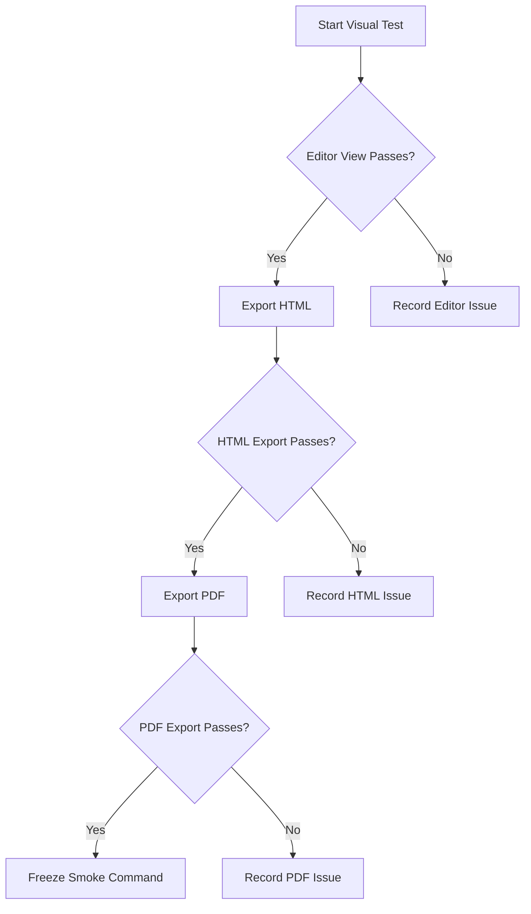

# Smoke Command Visual Smoke Test

Version: 1.0
Date: 2026-06-17

## Test Instructions

Copy this entire document into Typora, switch to the Smoke Command theme, and review each section visually.

Expected result: the document should look deliberate, readable, and internally consistent across editor view, HTML export, and PDF export.

If something fails, capture:

- Section name
- What looked wrong
- Whether the issue appears in editor view, HTML export, PDF export, or more than one output
- Screenshot if possible

## 1. Document Frame And Body Text

This paragraph tests default prose styling. The text should feel comfortable for long reading, with clear contrast against the dark page background. Line spacing should not feel cramped, and the document frame should surround the writing area cleanly.

This paragraph includes **bold text**, *italic text*, ***bold italic text***, ~~strikethrough text~~, `inline code`, [a normal link](https://example.com), and a bare URL: https://example.com.

The italic text should be visibly lighter and should not collapse into the background. Inline code should look technical but not loud.

## 2. Headings

# H1 Heading: Smoke Command Primary Title

The H1 should establish the strongest hierarchy without feeling oversized or disconnected from the rest of the page.

## H2 Heading: Section Title

The H2 should be clearly subordinate to H1 but still strong.

### H3 Heading: Three-Dot Indicator Check

The H3 should show the accepted three-dot indicator and align cleanly with the heading text.

#### H4 Heading: Smaller Section

H4 should remain distinct from body text.

##### H5 Heading: Compact Label

H5 should not look broken, weak, or cramped.

###### H6 Heading: Smallest Label

H6 should still be legible.

## 3. Horizontal Rule

Text before the horizontal rule.

---

Text after the horizontal rule. The line, centered diamond, and hover behavior should remain clean. If hover spin is visible, it should not be distracting.

## 4. Lists

### Unordered List

- First-level bullet
  - Second-level bullet
    - Third-level bullet
      - Fourth-level bullet
        - Fifth-level bullet
          - Sixth-level bullet
            - Seventh-level bullet
              - Eighth-level bullet
                - Ninth-level bullet
                  - Tenth-level bullet

The ten-level bullet styling should show a gradual size and color progression without connector lines.

### Ordered List

1. First ordered item
2. Second ordered item
   1. Nested ordered item
   2. Another nested ordered item
3. Third ordered item

Ordered lists should not show unwanted connector lines.

### Task List

- [ ] Unchecked task item
- [x] Checked task item
- [ ] Longer task item with enough text to wrap onto a second line so indentation and alignment can be inspected in Typora.

Task checkboxes should use the accepted accent color and align with list text.

## 5. Blockquotes

> This is a standard blockquote. It should use the accepted large quote marker and remain readable.

> This is a longer blockquote with multiple sentences. It tests wrapping, indentation, contrast, and spacing. The quote marker should not collide with the text.

## 6. Callouts And Alerts

> [!NOTE]
> This note tests the note alert styling and icon.

> [!TIP]
> This tip tests the tip alert styling and icon.

> [!IMPORTANT]
> This important alert tests emphasis, icon placement, and watermark treatment.

> [!WARNING]
> This warning tests warning color contrast and icon treatment.

> [!CAUTION]
> This caution alert tests high-severity styling and readability.

Each alert should use the expected emoji icon, including the larger watermark icon if visible.

## 7. Tables

| Element | Expected Appearance | Manual Result |
|---|---|---|
| Body text | Readable and calm | Pending |
| Links | Visible without being harsh | Pending |
| Inline code | Technical but controlled | Pending |
| Table | Centered and aligned | Pending |
| Borders | Visible but not heavy | Pending |

The table should be centered and should not stretch awkwardly across the full page.

## 8. Code Blocks

### JavaScript Code Block

```javascript
const themeName = "Smoke Command";
const version = "2.49";

function describeTheme(name, version) {
  return `${name} is ready for final visual smoke testing at v${version}.`;
}

console.log(describeTheme(themeName, version));
```

### CSS Code Block

```css
:root {
  --night-command-surface: #15121d;
  --night-command-text: #d6c8ea;
}

#write {
  max-width: 900px;
  margin: 0 auto;
}
```

### Language-Free Code Block

```
This code block has no language.
It should display the accepted TEXT label.
It should use the same code-block width behavior as other fenced code blocks.
```

### Long-Line Code Block

```text
This is a deliberately long line intended to test horizontal overflow, wrapping behavior, code block width, and whether the block stays visually contained inside the Smoke Command document frame without breaking the layout or forcing the page to feel unstable.
```

Code blocks should use Smoke Command colors, keep the red/yellow/green header dots, and respect the accepted width behavior.

## 9. Math

Inline math: $E = mc^2$

Block math:

$$
\int_0^1 x^2 dx = \frac{1}{3}
$$

Math should remain readable and should not inherit broken colors.

## 10. Mermaid Diagram



Mermaid edge labels should use pink boxes with light text.

## 11. Inline TOC

[TOC]

The inline table of contents should have tight accepted spacing. In edit mode, links may require Ctrl+Click. That is expected Typora behavior.

## 12. Images

<svg xmlns="http://www.w3.org/2000/svg" width="900" height="360" viewBox="0 0 900 360" role="img" aria-label="Smoke Command image rendering test">
  <rect width="900" height="360" fill="#17101F"/>
  <rect x="28" y="28" width="844" height="304" rx="18" fill="#21152F" stroke="#4B3764" stroke-width="4"/>
  <circle cx="156" cy="180" r="72" fill="#A78BFA" opacity="0.72"/>
  <circle cx="216" cy="180" r="72" fill="#F0A8C6" opacity="0.62"/>
  <text x="450" y="172" text-anchor="middle" fill="#E7DCF5" font-family="Georgia, serif" font-size="42" font-weight="700">Smoke Command</text>
  <text x="450" y="222" text-anchor="middle" fill="#D6C8EA" font-family="Georgia, serif" font-size="24">Local SVG image test</text>
</svg>

The image should fit inside the document frame without breaking spacing.

## 13. HTML Elements

<kbd>Ctrl</kbd> + <kbd>Shift</kbd> + <kbd>P</kbd>

<mark>Highlighted text should remain readable.</mark>

<details>
<summary>Expandable details test</summary>

This hidden content tests Typora's handling of native HTML elements under the theme.

</details>

## 14. Footnotes

This sentence includes a footnote reference.[^night-command-footnote]

[^night-command-footnote]: This is the footnote body. It should remain readable and visually connected to the reference.

## 15. Definition-Style Content

**Smoke Command**
: A dark Typora theme built around controlled contrast, editorial typography, and styled technical content.

**Smoke Command**
: The future light-theme counterpart.

Definition terms should be bold. Definition lines should be indented.

## 16. Sidebar, Outline, Menus, And Controls

Manual checks outside the document body:

- Sidebar file list text should use the accepted color.
- File-list separators should remain removed.
- Outline spacing should be tight but readable.
- Menus should match the Smoke Command surface and text treatment.
- Popovers should not show harsh white or gray rows.
- Scrollbars should look intentional.
- Preferences should match the theme.
- Footer and word-count controls should remain readable.

## 17. Export Checks

### HTML Export

Export this document to HTML.

Expected result:

- Dark page background remains.
- Document frame survives.
- Headings, code blocks, alerts, tables, and Mermaid output look intentional.
- No large white areas appear.

### PDF Export

Export this document to PDF.

Expected result:

- Dark page background remains.
- Page margins are tight.
- Content is not oversized.
- Code blocks do not break the page layout.
- No reverted scaling behavior appears.

## 18. Final Result

Use this checklist after testing:

- [ ] Editor view passes
- [x] Sidebar and outline pass
- [x] Menus and popovers pass
- [x] HTML export passes
- [x] PDF export passes
- [x] Known limitations are acceptable
- [x] Smoke Command can freeze at v2.60

<!-- END OF DOCUMENT -->
